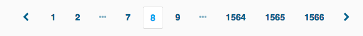
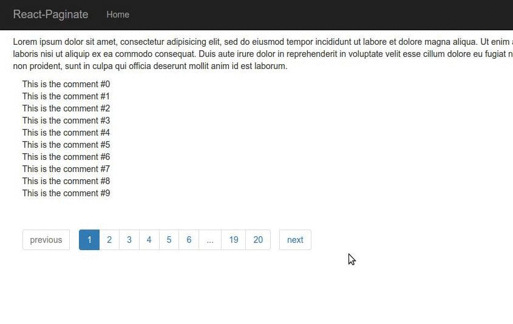

# react-paginate
[](https://travis-ci.org/AdeleD/react-paginate)

**A ReactJS component to render a pagination.**

By installing this component and writing only a little bit of CSS you can obtain this:


or



## Installation

Install `react-paginate` with [npm](https://www.npmjs.com/):

```
$ npm install react-paginate
```

For [CommonJS](http://wiki.commonjs.org/wiki/CommonJS) users:

```javascript
import ReactPaginate from 'react-paginate';
```

Read the code of [demo/js/demo.js][1]. You will quickly understand
how to make `react-paginate` work with a list of objects.

## Demo

Clone the repository and move into:

```console
$ git clone git@github.com:AdeleD/react-paginate.git
$ cd react-paginate
```

Install dependencies:

```console
$ make install
```

Prepare the demo:

```console
$ make demo
```

Run the server:

```console
$ make serve
```

Open your browser and go to `http://localhost:3000/`.



## Props

| Name | Type | Description |
| --- | --- | --- | --- |
| `pageNum` | `Number` | **Required.** The total number of pages. |
| `pageRangeDisplayed` | `Number` | **Required.** The range of pages displayed. |
| `marginPagesDisplayed` | `Number` | **Required.** The number of pages to display for margins. |
| `previousLabel` | `Node` | Label for the `previous` button. |
| `nextLabel` | `Node` | Label for the `next` button. |
| `breakLabel` | `Node` | Label for ellipsis. |
| `breakClassName` | `String` | The classname on tag `li` of the ellipsis element. |
| `clickCallback` | `Function` | The method to call when a page is clicked. |
| `initialSelected` | `Number` | The initial page selected. |
| `forceSelected` | `Number` | To override selected page with parent prop. |
| `containerClassName` | `String` | The classname of the pagination container. |
| `pageClassName` | `String` | The classname on tag `li` of each page element. |
| `pageLinkClassName` | `String` | The classname on tag `a` of each page element. |
| `activeClassName` | `String` | The classname for the active page. |
| `previousClassName` | `String` | The classname on tag `li` of the `previous` button. |
| `nextClassName` | `String` | The classname on tag `li` of the `next` button. |
| `previousLinkClassName` | `String` | The classname on tag `a` of the `previous` button. |
| `nextLinkClassName` | `String` | The classname on tag `a` of the `next` button. |
| `disabledClassName` | `String` | The classname for disabled `previous` and `next` buttons. |

## Contribute

1. [Submit an issue](https://github.com/AdeleD/react-paginate/issues)
2. Fork the repository
3. Create a dedicated branch (never ever work in `master`)
4. The first time, run command: `webpack` into the directory
5. Run `npm start`
6. Fix bugs or implement features
7. Always write tests

Run tests:

```console
$ make test
```

[1]: https://github.com/AdeleD/react-paginate/blob/master/demo/js/demo.js
